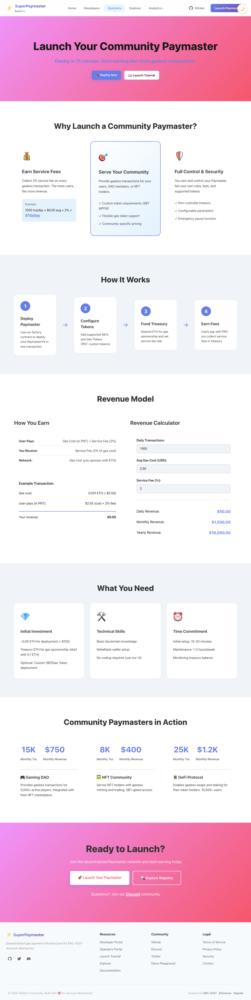
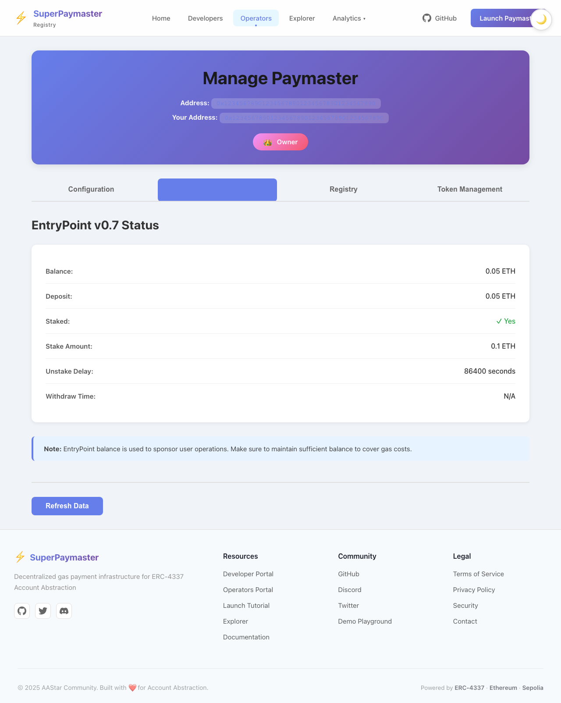
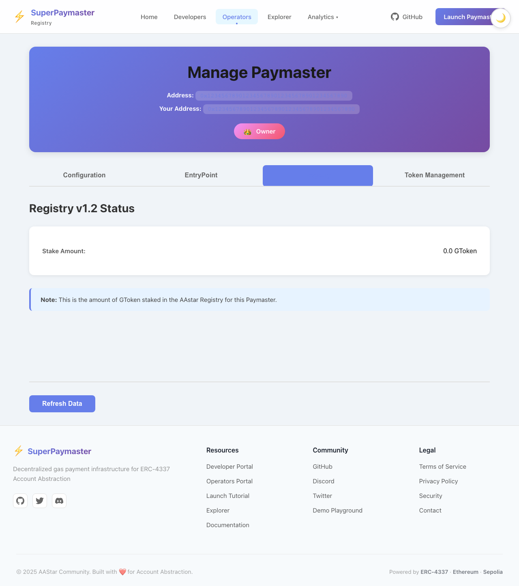
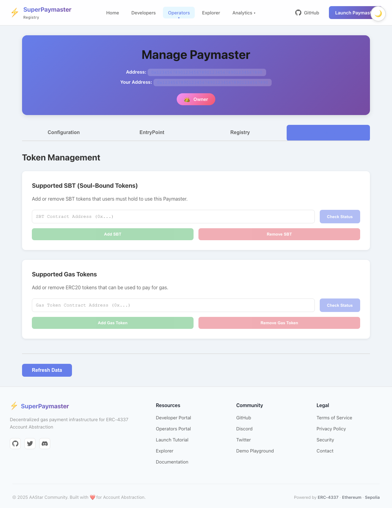
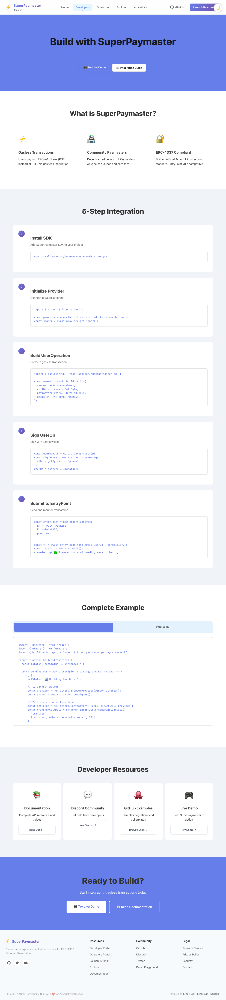
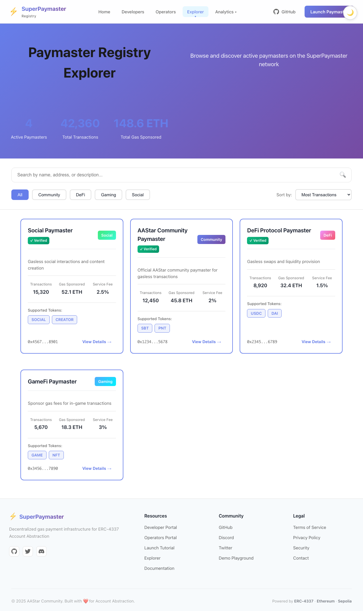

# SuperPaymaster Registry 用户指南（带截图）

## 📚 目录

1. [应用概述](#应用概述)
2. [主页 - 快速导览](#主页---快速导览)
3. [操作员门户 - 部署和管理](#操作员门户---部署和管理)
4. [管理 Paymaster - 完整指南](#管理-paymaster---完整指南)
5. [开发者门户 - 集成指南](#开发者门户---集成指南)
6. [浏览器 - 查找 Paymaster](#浏览器---查找-paymaster)

---

## 应用概述

**SuperPaymaster Registry** 是一个去中心化的 Gasless 交易基础设施，基于 ERC-4337 标准。

### 核心概念

- **Paymaster**: 代付 Gas 费用的智能合约，让用户可以无需 ETH 即可发送交易
- **Entry Point v0.7**: ERC-4337 标准的入口合约（`0x0000000071727De22E5E9d8BAf0edAc6f37da032`）
- **Registry**: Paymaster 注册中心（`0x838da93c815a6E45Aa50429529da9106C0621eF0`）
- **PNT**: Paymaster Native Token，用于支付 Gas 费用
- **GToken**: 质押代币，用于注册到 Registry

---

## 主页 - 快速导览

### 访问地址
```
http://localhost:5173/
```

### 界面截图


### 主要功能

1. **🔍 Explore Registry** - 浏览所有已注册的 Paymaster
2. **👨‍💻 Developer Portal** - 开发者集成文档和工具
3. **🏪 Operator Portal** - 操作员部署和管理界面

### 平台统计

- **Community Paymasters**: 当前注册的 Paymaster 数量
- **Gasless Transactions**: 已处理的无 Gas 交易数
- **Gas Fees Saved**: 为用户节省的 Gas 费用总额

### 核心特性

#### ✅ True Decentralization（真正的去中心化）
- 无单点故障
- 社区运营的 Paymaster
- 任何人都可以部署和使用

#### ✅ Flexible Payment Models（灵活的支付模式）
- **Direct Payment Mode**: 按交易付费
- **Staking Mode**: 一次存款，多次使用
- 支持任何 ERC-20 代币

#### ✅ Developer Friendly（开发者友好）
- ERC-4337 兼容
- 5 分钟集成
- 完整的 TypeScript SDK

---

## 操作员门户 - 部署和管理

### 访问地址
```
http://localhost:5173/operator
```

### 界面截图



### 主要功能

#### 1. Deploy New Paymaster（部署新 Paymaster）

**准备工作**:
- ✅ 安装 MetaMask 并切换到 Sepolia 测试网
- ✅ 准备 0.5-1 ETH（用于部署和质押）
- ✅ 准备 100+ GToken（用于注册到 Registry）

**获取测试代币**:
- Sepolia ETH: https://sepoliafaucet.com/
- PNT Token: http://localhost:5173/get-pnts
- GToken: http://localhost:5173/get-gtoken

**部署流程**（7 步向导）:

**Step 1: Configuration（配置）**
- Paymaster Name
- Treasury Address（收款地址）
- Service Fee Rate（服务费率，基点）
- Gas to USD Rate
- PNT Price USD
- Max Gas Cost Cap
- Min Token Balance

**Step 2: Connect Wallet（连接钱包）**
- 连接 MetaMask
- 确认网络为 Sepolia

**Step 3: Stake Option（质押选项）**
- 选择是否质押 ETH 到 EntryPoint
- 推荐质押 0.1-1 ETH

**Step 4: Deploy Contract（部署合约）**
- 自动部署 PaymasterV4 合约
- 等待交易确认（约 15-30 秒）

**Step 5: Stake to EntryPoint（质押到入口点）**
- 如果选择了质押，执行质押交易

**Step 6: Register to Registry（注册到注册中心）**
- Approve GToken
- 注册 Paymaster

**Step 7: Complete（完成）**
- 获取 Paymaster 地址
- 进入管理界面

#### 2. Manage Existing（管理现有 Paymaster）

点击后跳转到管理界面（需要提供 Paymaster 地址）

---

## 管理 Paymaster - 完整指南

### 访问地址
```
http://localhost:5173/operator/manage?address=<PAYMASTER_ADDRESS>
```

### 界面概览


### Tab 1: Configuration（配置参数）

**显示信息**:
- Paymaster Address
- Your Address
- Owner Badge（👑 Owner 或 👁️ Viewer）

**配置参数表格**（7 个参数）:

| 参数 | 说明 | 可编辑 |
|------|------|--------|
| **Owner** | 所有者地址 | ✅ Owner only |
| **Treasury** | 收款地址 | ✅ Owner only |
| **Gas to USD Rate** | Gas 价格汇率 | ✅ Owner only |
| **PNT Price (USD)** | PNT 代币价格 | ✅ Owner only |
| **Service Fee Rate** | 服务费率（基点） | ✅ Owner only |
| **Max Gas Cost Cap** | 最大 Gas 成本上限 | ✅ Owner only |
| **Min Token Balance** | 用户最小余额要求 | ✅ Owner only |

**编辑参数**:
1. 点击参数右侧的 **[Edit]** 按钮
2. 输入新值
3. 点击 **[Save]**
4. 在 MetaMask 确认交易
5. 等待确认（约 15 秒）

**Pause Control（暂停控制）**:
- **Active**: 点击 **[Pause Paymaster]** 暂停服务
- **Paused**: 点击 **[Unpause Paymaster]** 恢复服务

---

### Tab 2: EntryPoint（入口点状态）



**显示信息**:

- **Balance**: Paymaster 在 EntryPoint 的 ETH 余额
  - ⚠️ 如果 < 0.01 ETH，需要充值
  - 用于支付用户的 Gas 费用

- **Deposit**: 存款金额（wei）

- **Staked**: 是否已质押
  - ✓ Yes: 已质押（提高信任度）
  - ✗ No: 未质押

- **Stake Amount**: 质押的 ETH 数量
  - 越高越好，推荐 ≥ 0.1 ETH

- **Unstake Delay**: 解除质押的等待时间
  - 建议 ≥ 86400 秒（1 天）

- **Withdraw Time**: 可以提款的时间
  - N/A: 未开始解除质押

**充值 EntryPoint 余额**:

```typescript
import { ethers } from 'ethers';

const ENTRY_POINT = '0x0000000071727De22E5E9d8BAf0edAc6f37da032';
const PAYMASTER = '0x你的Paymaster地址';

const provider = new ethers.BrowserProvider(window.ethereum);
const signer = await provider.getSigner();

const entryPoint = new ethers.Contract(
  ENTRY_POINT,
  ['function depositTo(address account) payable'],
  signer
);

// 充值 0.1 ETH
const tx = await entryPoint.depositTo(PAYMASTER, {
  value: ethers.parseEther('0.1')
});

await tx.wait();
```

---

### Tab 3: Registry（注册中心状态）



**显示信息**:

- **Stake Amount**: 在 Registry 质押的 GToken 数量
  - 质押越多，排名越高
  - 用户更容易发现你的 Paymaster

**说明**:
- Registry 地址: `0x838da93c815a6E45Aa50429529da9106C0621eF0`
- 最低质押: 100 GToken
- 质押可以增加，但不能减少（除非取消注册）

---

### Tab 4: Token Management（代币管理）



**功能**: 管理支持的 SBT 和 Gas Token

#### A. Supported SBT（支持的 Soul-Bound Tokens）

**用途**: 限制只有持有特定 SBT 的用户才能使用 Paymaster

**操作步骤**:
1. 输入 SBT 合约地址
2. 点击 **[Check Status]** 检查是否已支持
3. 查看状态:
   - ✓ This SBT is currently supported（已支持）
   - ✗ This SBT is not supported（未支持）
4. Owner 可以:
   - **[Add SBT]**: 添加新的 SBT
   - **[Remove SBT]**: 移除已有的 SBT

**示例**:
```
SBT Address: 0xabcdef1234567890abcdef1234567890abcdef12
[Check Status] → ✗ This SBT is not supported
[Add SBT] → MetaMask 确认 → 添加成功
```

#### B. Supported Gas Tokens（支持的 Gas 代币）

**用途**: 允许用户使用特定 ERC20 代币支付 Gas 费用

**操作步骤**:
1. 输入 Gas Token 合约地址
2. 点击 **[Check Status]**
3. Owner 可以添加或移除

**常用 Gas Token**（Sepolia）:
- USDC: `0x...`
- USDT: `0x...`
- DAI: `0x...`
- PNT: `0x...`

---

### 刷新数据

点击页面底部的 **[Refresh Data]** 按钮重新加载所有数据。

---

## 开发者门户 - 集成指南

### 访问地址
```
http://localhost:5173/developer
```

### 界面截图



### 集成步骤

#### 1. 选择 Paymaster

访问 Explorer 选择合适的 Paymaster:
- EntryPoint 余额充足（≥ 0.05 ETH）
- Registry 质押高（排名靠前）
- 服务费率合理（≤ 5%）
- 支持你需要的 Gas Token

#### 2. 安装 SDK

```bash
npm install @aastar/sdk ethers
```

#### 3. 初始化客户端

```typescript
import { ethers } from 'ethers';
import { AAStarClient } from '@aastar/sdk';

const PAYMASTER = '0x你选择的Paymaster地址';
const ENTRY_POINT = '0x0000000071727De22E5E9d8BAf0edAc6f37da032';

const provider = new ethers.BrowserProvider(window.ethereum);
const signer = await provider.getSigner();

const aaClient = new AAStarClient({
  entryPoint: ENTRY_POINT,
  paymaster: PAYMASTER,
  bundlerUrl: 'https://bundler.example.com',
});
```

#### 4. 创建 UserOperation

```typescript
// 创建 UserOperation
const userOp = await aaClient.createUserOp({
  sender: await signer.getAddress(),
  target: '0x目标合约地址',
  data: '0x调用数据',
  value: 0,
});

// 请求 Paymaster 签名
const signedUserOp = await aaClient.signUserOp(userOp, signer);

// 提交到 Bundler
const txHash = await aaClient.sendUserOp(signedUserOp);

console.log('Transaction Hash:', txHash);
```

#### 5. 处理用户支付

如果 Paymaster 要求用户支付 PNT:

```typescript
const PNT_TOKEN = '0xPNT代币地址';

// 1. 批准 Paymaster 使用 PNT
const pntToken = new ethers.Contract(
  PNT_TOKEN,
  ['function approve(address spender, uint256 amount) returns (bool)'],
  signer
);

await pntToken.approve(PAYMASTER, ethers.parseEther('100'));

// 2. 发送交易（Paymaster 会自动扣除 PNT）
const txHash = await aaClient.sendUserOp(signedUserOp);
```

---

## 浏览器 - 查找 Paymaster

### 访问地址
```
http://localhost:5173/explorer
```

### 界面截图



### 功能

#### 1. 浏览所有 Paymaster

显示所有已注册到 Registry 的 Paymaster

#### 2. 筛选和搜索

**筛选条件**:
- ☑ Active Only（仅显示活跃的）
- ☑ Staked Only（仅显示已质押的）
- ☑ Low Fee（仅显示低费率的，< 2%）

**搜索**:
- 按地址搜索
- 按名称搜索

#### 3. 查看详情

每个 Paymaster 卡片显示:
- **Name**: Paymaster 名称
- **Address**: 合约地址
- **EntryPoint Balance**: EntryPoint 余额
- **Service Fee**: 服务费率
- **Staked**: 是否已质押
- **Registry Stake**: Registry 质押金额

点击 **[View Details]** 查看完整信息:
- 所有配置参数
- EntryPoint 状态
- Registry 质押
- 支持的代币列表
- 历史交易统计

点击 **[Use This Paymaster]** 复制地址用于集成

---

## 常见问题

### 1. MetaMask 未检测到

**问题**: 页面显示 "MetaMask is not installed"

**解决方案**:
1. 安装 MetaMask 浏览器扩展
2. 刷新页面
3. 确保 MetaMask 已解锁

### 2. 交易失败: "Insufficient EntryPoint balance"

**问题**: Paymaster EntryPoint 余额不足

**解决方案**:
1. 访问管理页面的 **EntryPoint** Tab
2. 检查 Balance（应 ≥ 0.05 ETH）
3. 按照上面的代码示例充值

### 3. 无法编辑参数

**问题**: Edit 按钮是灰色的

**原因**: 你不是 Paymaster 的 Owner

**解决方案**:
- 确认连接的钱包地址与 Owner 地址一致
- Viewer 只能查看数据，不能修改

### 4. 用户交易被拒绝

**可能原因**:
1. **Paymaster 已暂停** - 在管理页面 Unpause
2. **EntryPoint 余额不足** - 充值 ETH
3. **用户不满足条件**:
   - 没有持有要求的 SBT
   - 没有足够的 PNT 支付费用
   - 代币余额低于 Min Token Balance

---

## 附录

### A. 合约地址（Sepolia 测试网）

```
EntryPoint v0.7: 0x0000000071727De22E5E9d8BAf0edAc6f37da032
Registry v1.2:   0x838da93c815a6E45Aa50429529da9106C0621eF0
```

### B. 测试代币获取

**Sepolia ETH**:
- https://sepoliafaucet.com/
- https://faucet.quicknode.com/ethereum/sepolia

**PNT Token**:
- 访问: http://localhost:5173/get-pnts

**GToken**:
- 访问: http://localhost:5173/get-gtoken

### C. 推荐参数配置

| 参数 | 推荐值 | 说明 |
|------|--------|------|
| Service Fee Rate | 200 (2%) | 不要太高，避免用户流失 |
| Gas to USD Rate | 4500 | 根据实际 Gas 价格调整 |
| PNT Price USD | 0.02 | 根据市场价格设置 |
| Max Gas Cost Cap | 0.1 ETH | 防止异常高额交易 |
| Min Token Balance | 100 tokens | 确保用户有足够余额 |
| EntryPoint Stake | ≥ 0.1 ETH | 提高信任度 |
| Registry Stake | ≥ 100 GToken | 提高排名 |

---

## 总结

通过本指南和截图，你应该能够：

✅ 理解 SuperPaymaster Registry 的界面和功能
✅ 成功部署和配置自己的 Paymaster
✅ 管理 Paymaster 的所有参数和状态
✅ 集成 Paymaster 到你的 dApp
✅ 查找和选择合适的 Paymaster

**下一步**:
1. 部署一个测试 Paymaster
2. 充值 EntryPoint 余额
3. 配置支持的代币
4. 邀请开发者使用

**需要帮助?**
- GitHub: https://github.com/AAStarCommunity/registry
- Discord: https://discord.gg/aastar
- 文档: https://docs.aastar.io

---

**版本**: v2.0 (带真实截图)
**更新日期**: 2025-10-17
**作者**: AAStar Community
