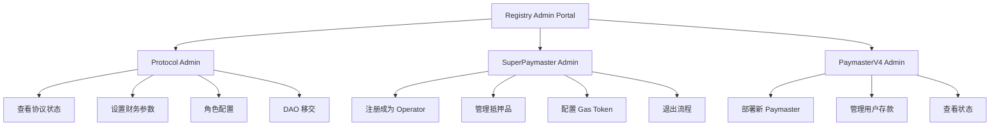

# Registry V3 Admin System - Product Design Document

## Overview

本文档定义 Registry V3 Admin System 的产品设计，专注于三个核心管理角色的工作流程，**所有功能必须基于 @aastar/sdk API 实现**，禁止直接操作合约。

---

## 角色定义

### 1. 协议 Admin (Protocol Admin)
**职责**：SuperPaymaster 系列合约的部署者和最高管理者

| 权限 | 描述 | SDK API |
|------|------|---------|
| setTreasury | 设置协议费用接收地址 | `ProtocolGovernance.setTreasury()` |
| setSuperPaymaster | 更新 SuperPaymaster 合约地址 | `ProtocolGovernance.setSuperPaymaster()` |
| setStaking | 设置 Staking 合约地址 | `ProtocolGovernance.setStaking()` |
| configureRole | 配置角色参数(minStake, entryBurn等) | `ProtocolGovernance.configureRole()` |
| transferToDAO | 将协议所有权转移给 DAO | `ProtocolGovernance.transferToDAO()` |
| getProtocolParams | 查询协议全局参数 | `ProtocolGovernance.getProtocolParams()` |

**SDK 依赖**：`@aastar/admin` → `ProtocolGovernance`

---

### 2. SuperPaymaster 管理者 (SuperPaymaster Admin)
**职责**：SuperPaymaster 节点运营商

| 权限 | 描述 | SDK API |
|------|------|---------|
| registerAsSuperPaymasterOperator | 注册成为 Super Operator | `PaymasterOperatorClient.registerAsSuperPaymasterOperator()` |
| configureOperator | 配置 xPNTs/Treasury/ExchangeRate | `PaymasterOperatorClient.configureOperator()` |
| depositCollateral | 存入抵押品 (aPNTs) | `PaymasterOperatorClient.depositCollateral()` |
| withdrawCollateral | 提取抵押品 | `PaymasterOperatorClient.withdrawCollateral()` |
| addGasToken | 添加支持的 Gas Token | `PaymasterOperatorClient.addGasToken()` |
| setProtocolFee | 设置协议费率 | `ProtocolClient.setProtocolFee()` |
| initiateExit | 发起退出流程 | `OperatorLifecycle.initiateExit()` |
| getOperatorDetails | 查询 Operator 状态 | `PaymasterOperatorClient.getOperatorDetails()` |

**SDK 依赖**：`@aastar/operator` → `PaymasterOperatorClient`, `OperatorLifecycle`

---

### 3. PaymasterV4 管理者 (PaymasterV4 Admin)
**职责**：Paymaster V4 合约的部署者和运营者

| 权限 | 描述 | SDK API |
|------|------|---------|
| deployAndRegisterPaymasterV4 | 部署并注册新的 Paymaster V4 | `PaymasterOperatorClient.deployAndRegisterPaymasterV4()` |
| setupPaymasterDeposit | 设置用户存款配置 | `PaymasterOperatorClient.setupPaymasterDeposit()` |
| getTokenPrice | 查询 Token 价格 | `PaymasterOperatorClient.getTokenPrice()` |

**SDK 依赖**：`@aastar/operator` → `PaymasterOperatorClient`

---

## 前端交互流程设计



---

## 场景拆分与 API 依赖

### 场景 1: Protocol Admin - 查看协议状态

```typescript
import { ProtocolGovernance } from '@aastar/admin';

const governance = new ProtocolGovernance({
    registryAddress,
    entryPointAddress,
    signer
});

const params = await governance.getProtocolParams();
// 返回: { minStake, treasury, entryPoint, superPaymaster }
```

---

### 场景 2: Protocol Admin - 配置角色参数

```typescript
await governance.configureRole({
    roleId: ROLE_PAYMASTER_SUPER,
    minStake: parseEther('50'),
    entryBurn: parseEther('1'),
    exitFeePercent: 100n,
    minExitFee: parseEther('5')
});
```

---

### 场景 3: Protocol Admin - 查询用户角色

```typescript
import { registryActions } from '@aastar/core';

const registry = registryActions(registryAddress)(client);
const hasRole = await registry.hasRole({ 
    roleId: ROLE_PAYMASTER_SUPER, 
    user: userAddress 
});
```

---

### 场景 4: SuperPaymaster Admin - 注册成为 Operator

```typescript
import { PaymasterOperatorClient } from '@aastar/operator';

const client = new PaymasterOperatorClient({
    superPaymasterAddress,
    signer
});

await client.registerAsSuperPaymasterOperator({
    stakeAmount: parseEther('50'),
    depositAmount: parseEther('100')
});
```

---

### 场景 5: SuperPaymaster Admin - 管理抵押品

```typescript
// 存入
await client.depositCollateral(parseEther('50'));

// 提取
await client.withdrawCollateral(recipientAddress, parseEther('20'));
```

---

### 场景 6: SuperPaymaster Admin - 退出流程

```typescript
import { OperatorLifecycle } from '@aastar/operator';

const lifecycle = new OperatorLifecycle({ superPaymasterAddress, signer });

// Step 1: 发起退出
await lifecycle.initiateExit();

// Step 2: 等待冷却期后提取
await lifecycle.withdrawAllFunds(recipientAddress);
```

---

### 场景 7: PaymasterV4 Admin - 部署新 Paymaster

```typescript
const result = await client.deployAndRegisterPaymasterV4({
    stakeAmount: parseEther('10'),
    salt: 1n
});

console.log('New Paymaster:', result.paymasterAddress);
```

---

## SDK API 可用性确认

| 功能 | API 位置 | 状态 |
|------|----------|------|
| 角色查询 (hasRole) | `@aastar/core` → `registryActions.hasRole()` | ✅ 已有 |
| 冷却期查询 | `@aastar/core` → `stakingActions.hasRoleLock()` | ✅ 已有 |
| 批量添加 Gas Token | 需要封装 | ⚠️ 可后续添加 |
| 历史记录查询 | 需要事件查询 | ⚠️ 可后续添加 |

> 所有核心功能的 API 均已具备，可以开始开发。

---

## 开发阶段划分

### Phase 1: Protocol Admin Dashboard
- [ ] 协议状态查看页面
- [ ] 角色配置页面
- [ ] DAO 移交流程

### Phase 2: SuperPaymaster Admin
- [ ] 注册成为 Operator 流程
- [ ] 抵押品管理页面
- [ ] Gas Token 配置页面
- [ ] 退出流程

### Phase 3: PaymasterV4 Admin
- [ ] 部署新 Paymaster 流程
- [ ] Paymaster 状态查看
